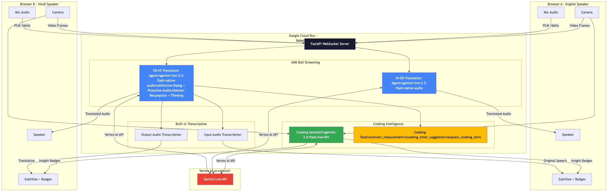

# 🍳 BabelChef — Real-Time Bilingual Video Call Translator

> Mom speaks Hindi, wife speaks English. BabelChef uses Gemini Live API to translate their video call in real-time — so Mom can guide her through biryani, spice by spice.

[](https://geminiliveagentchallenge.devpost.com/)
[](https://google.github.io/adk-docs/streaming/)
[](https://ai.google.dev/gemini-api/docs/models)
[](https://cloud.google.com/run)

---

## 🎯 The Problem

When two family members speak different languages, real-time collaboration breaks down:

- **Google Translate**: Text-based, turn-by-turn — too slow for "Add the spices NOW!"
- **Video calls** (FaceTime, WhatsApp): No translation at all
- **Interpreter apps**: No video, no visual context, no cultural understanding
- **Kitchen noise**: Sizzling, chopping, and clattering trigger phantom translations
- **Session drops**: Long cooking sessions (30-60 min) exceed API timeouts

BabelChef solves all of this with **vision-aware, culturally-intelligent, real-time audio translation over video calls**.

## ✨ How It Works

Two people join a video call, each speaking their own language. Gemini translates in real-time:

1. **Wife speaks English** → audio sent to EN→HI Gemini Agent → Mom hears Hindi
2. **Mom speaks Hindi** → audio sent to HI→EN Gemini Agent → Wife hears English
3. **Camera feeds** sent to Gemini for **visual context** — so when Mom says "that looks done," the AI understands *what* she's looking at
4. **Cooking Assistant** watches the video and provides real-time cultural cooking insights

## 🏆 Gold Standard Features (7 Gemini Live API Capabilities)

| #  | Feature | What It Does | Config |
|----|---------|-------------|--------|
| 1  | **Session Resumption** | Survives 10-min WebSocket limits for long cooking sessions | `SessionResumptionConfig` |
| 2  | **Context Window Compression** | Unlimited session duration without memory degradation | `ContextWindowCompressionConfig` |
| 3  | **Input Audio Transcription** | Shows original speech as subtitles | `AudioTranscriptionConfig` |
| 4  | **Output Audio Transcription** | Shows translated speech as subtitles | `AudioTranscriptionConfig` |
| 5  | **Affective Dialog** | Preserves emotional tone — excitement, urgency, tenderness | `enable_affective_dialog` |
| 6  | **Proactive Audio** | Filters kitchen noise (sizzling, chopping) — no phantom translations | `ProactivityConfig` |
| 7  | **Function Calling (Cooking Tools)** | Mid-conversation measurement conversion, timer suggestions, term explanations | `FunctionDeclaration` |

### 🔧 Cooking Tools (Function Calling)

The translation agent can invoke three tools mid-conversation:

- **`convert_measurement`** — "How many grams is 2 cups of flour?" → supports metric, imperial, and Indian units
- **`cooking_timer_suggestion`** — "How long should I boil the rice?" → timing + tips
- **`explain_cooking_term`** — "What does tadka mean?" → culturally-aware explanations

### 🧠 Thinking Config

Gemini uses a **thinking budget** (512 tokens) for complex translations — idiomatic cooking expressions like "temper the spices" or "the onions are sweating" get contextually accurate translations rather than literal word-for-word.

## 🏗️ Architecture



```
┌─────────────┐     WebSocket      ┌──────────────────────────┐     WebSocket      ┌─────────────┐
│  Browser A  │◄──────────────────►│   Cloud Run: BabelChef   │◄──────────────────►│  Browser B  │
│ (English)   │  audio + video     │                          │  audio + video     │  (Hindi)    │
└─────────────┘                    │  ┌────────────────────┐  │                    └─────────────┘
                                   │  │ EN→HI Agent        │  │
                                   │  │ gemini-live-2.5-   │  │
                                   │  │ flash-native-audio │  │
                                   │  │ + Cooking Tools    │  │
                                   │  │ + Thinking Config  │  │
                                   │  └────────────────────┘  │
                                   │  ┌────────────────────┐  │
                                   │  │ HI→EN Agent        │  │
                                   │  │ (same model)       │  │
                                   │  └────────────────────┘  │
                                   │  ┌────────────────────┐  │
                                   │  │ Cooking Assistant   │  │
                                   │  │ gemini-2.0-flash-  │  │
                                   │  │ live-001 (TEXT)     │  │
                                   │  │ → Cultural badges   │  │
                                   │  └────────────────────┘  │
                                   └──────────────────────────┘
                                             │
                                        Vertex AI API
                                    (us-central1 region)
```

### Key Technical Decisions

| Decision | Choice | Why |
|---|---|---|
| **Two translation agents** | EN→HI + HI→EN | Independent pipelines prevent crosstalk |
| **Separate cooking assistant** | `gemini-2.0-flash-live-001` | Needs TEXT output (native-audio model only outputs audio) |
| **Vision-aware translation** | Video frames → Gemini | "That's ready" → AI sees what "that" refers to |
| **ADK Bidi Streaming** | `LiveRequestQueue` + `run_live()` | Handles interruptions, concurrent streams, state |
| **Session Resumption** | `SessionResumptionConfig` | Long cooking sessions survive WebSocket limits |
| **Proactive Audio** | `ProactivityConfig` | Kitchen noise filtering — no phantom translations |
| **Cloud Run** | Session affinity + 1hr timeout | WebSocket support for long cooking sessions |

## 🚀 Quick Start

### Prerequisites

- Python 3.11+
- [uv](https://docs.astral.sh/uv/) (recommended) or pip
- Google Cloud project with Vertex AI API enabled
- Google Cloud Application Default Credentials (`gcloud auth application-default login`)

### 1. Clone & Install

```bash
git clone https://github.com/admin640/babelchef-live-translator.git
cd babelchef-live-translator

# Option A: Using uv (recommended, same as production)
curl -LsSf https://astral.sh/uv/install.sh | sh
uv venv && source .venv/bin/activate
uv pip install -e .

# Option B: Using pip
python3 -m venv .venv && source .venv/bin/activate
pip install -e .
```

### 2. Configure Environment

```bash
cp .env.example .env
# Edit .env with your credentials
```

**Required variables:**
```env
# Google Cloud (Vertex AI)
GOOGLE_CLOUD_PROJECT=your-project-id
GOOGLE_CLOUD_LOCATION=us-central1
GOOGLE_GENAI_USE_VERTEXAI=TRUE

# LiveKit (for WebRTC video relay)
LIVEKIT_URL=wss://your-livekit-instance.livekit.cloud
LIVEKIT_API_KEY=your-key
LIVEKIT_API_SECRET=your-secret
```

### 3. Run Locally

```bash
uvicorn app.main:app --reload --port 8080
```

Open http://localhost:8080 in your browser.

### 4. Test a Call

1. Open **two browser tabs** at http://localhost:8080
2. **Tab 1**: Select "English Speaker" → Choose target language → Click "Create New Room" → Note the room code
3. **Tab 2**: Select "Hindi Speaker" → Enter the room code → Click "Join"
4. Both tabs switch to the call screen — **start speaking!**

## ☁️ Deploy to Cloud Run

### Automated (recommended)

```bash
chmod +x deploy.sh
./deploy.sh
```

### Manual

```bash
gcloud run deploy babelchef-live-translator \
    --source . \
    --region us-central1 \
    --project your-project-id \
    --allow-unauthenticated \
    --set-env-vars "GOOGLE_CLOUD_PROJECT=your-project,GOOGLE_CLOUD_LOCATION=us-central1,GOOGLE_GENAI_USE_VERTEXAI=TRUE" \
    --memory 1Gi \
    --timeout 3600 \
    --session-affinity
```

## 📁 Project Structure

```
babelchef-live-translator/
├── app/
│   ├── main.py                    # FastAPI + WebSocket + ADK agents (translation + cooking)
│   ├── cooking_tools.py           # Function calling tools (measurement, timer, terms)
│   ├── agents/
│   │   └── __init__.py
│   └── static/                    # Web client
│       ├── index.html             # UI with subtitle overlay + cooking badges
│       ├── css/style.css          # Premium dark theme
│       └── js/
│           ├── app.js             # Room/call management + transcription display
│           └── pcm-capture-processor.js  # PCM audio worklet
├── docs/
│   └── architecture.png           # Architecture diagram
├── Dockerfile                     # Production container
├── deploy.sh                      # Automated Cloud Run deployment
├── start.sh                       # Container entrypoint
├── pyproject.toml                 # Python dependencies
├── .env.example                   # Environment template
└── README.md
```

## 🛠️ Built With

| Technology | Usage |
|---|---|
| [**Gemini Live 2.5 Flash Native Audio**](https://ai.google.dev/gemini-api/docs/models) | Bidirectional real-time translation with native audio I/O |
| [**Gemini 2.0 Flash Live**](https://ai.google.dev/gemini-api/docs/models) | Cooking assistant (text output for insight badges) |
| [**ADK (Agent Development Kit)**](https://google.github.io/adk-docs/) | Bidi streaming, LiveRequestQueue, RunConfig, function calling |
| [**Google Cloud Run**](https://cloud.google.com/run) | Serverless container hosting with WebSocket + session affinity |
| [**Vertex AI**](https://cloud.google.com/vertex-ai) | Gemini model serving in us-central1 |
| [**FastAPI**](https://fastapi.tiangolo.com/) | Python web framework with WebSocket support |
| [**Web Audio API**](https://developer.mozilla.org/en-US/docs/Web/API/Web_Audio_API) | Browser-based PCM audio capture and playback (16kHz mono) |

## 🏆 Challenge Alignment

This project is submitted to the **Live Agents 🗣️** category:

- ✅ **Real-time interaction**: Bidirectional audio/vision translation
- ✅ **Natural conversation**: Barge-in / interruption handling via ADK
- ✅ **Distinct persona**: Translation agent with cultural cooking awareness
- ✅ **Gemini Live API**: Core technology for all translation
- ✅ **ADK**: Agent Development Kit for streaming, tools, and session management
- ✅ **Google Cloud**: Cloud Run (hosting) + Vertex AI (model serving)

## 📄 License

Apache 2.0

---

*Built for the [Gemini Live Agent Challenge](https://geminiliveagentchallenge.devpost.com/) 🏆 #GeminiLiveAgentChallenge*
